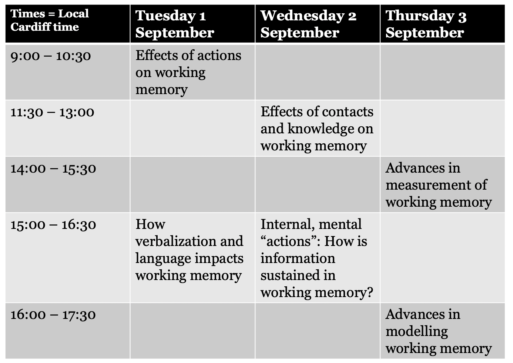

--- 
title: "Abstracts of the 10th European Working Memory Symposium"
author: "Cardiff University Steering Committee for EWoMSX: Candice Morey, Craig Hedge, & Lizzie Smith"
date: "`r Sys.Date()`"
site: bookdown::bookdown_site
output: bookdown::gitbook
documentclass: book
bibliography: [book.bib, packages.bib]
biblio-style: apalike
link-citations: yes
fontsize: 12pt
linestretch: 1.5
description: "Abstracts and program for the 10th European Working Memory Symposium (EWoMS). EWoMS X was due to be held at Cardiff University 1-3 September 2020, but due to the uncertainty created by the novel coronavirus pandemic, the program will take place virtually. This program book includes details on the format of the sessions, information about where to find the pre-recorded talks, and abstracts of the research presented."
---

# The 10th European Working Memory Symposium

The 10th European Working Memory Symposium (EWoMSX) is also the 1st EWoMS to be held virtually. Instead of gathering in Cardiff on 1-3 September 2020, we will be "gathering" from our own locales to discuss the latest advances in working memory research. EWoMS has traditionally been a cozy gathering, excellent for showcasing the work of early career researchers and promoting discussion. We will attempt to preserve this spirit under the circumstances so that our community misses out on as little as possible while we have to work in this manner. 

## Theme: Working Memory in Action

Working memory highlights a distinction between dormant knowledge and information that is immediately relevant, and on the point of being used in the service of some action. At EWoMSX we will focus on relationships between memory and actions: broadly construed, this includes investigations of proposed internal processes that may strengthen or transform memories, investigations of sensorimotor interactions, and distinctions between sensorimotor and representation-based theories of immediate memory. 

## How EWoMSX will work

* Pre-recorded talks available on EWoMS Youtube channel from mid-August

* Sessions will take place via Zoom. The 90-minute sessions will include some time for unstructured chat with the authors of talks in the session, and discussant-led consideration of the theme of the session. 

* Watch the talks associated with a session ahead of the session start time

* Push questions to discussants - via email and social media in advance, or during session via chat functions

## Registration

[Registration](https://cardiffunipsych.eu.qualtrics.com/jfe/form/SV_0VYX845gbq54Arr) is open now. Registration is free, but you must register to attend so we can ensure security during the events. Please register even if you are presenting!

## Other interactions

* Upcoming job opportunity showcases (tick the box during Registration if you are interested in holding one of these)

* Proposal meetings: Some abstracts have been presented prior to the official start of EWoMSX to smaller groups of researchers, with the aim of providing advice on projects that were disrupted by the novel coronavirus pandemic. These abstracts are available in LINK along with authors' contact information in case you would like to discuss their projects with them. *Recordings of these presentations of preliminary work are not available on the YouTube channel*.

* Local hubs -  in some regions, it may be possible in September for small groups to gather together for the EWoMS sessions. If this applies in your region, you can organize a hub. If you are organizing a hub, let us know how it goes and tag #EWOMSX on social media with your ideas for making it festive and your pictures!

* Top-down and bottom-up virtual social events - We will open the meeting Zoom link before and after sessions each day of the meeting for those interested in unstructured social interaction with colleagues. Because this might not work well in all time zones, we also strongly encourage the community to organize other meet-up possibilities convenient to their time-zones, which we will help broadcast to the conference attendees.

## Schedule Overview: Provisional!

Although EWoMS is situated in Europe, we have delegates from all hemispheres. We have tried to ensure that the times of the sessions are reasonable for the speakers associated with the session to attend. (NB- after registration we may find that some of our assumptions about where speakers will be attending from are incorrect, and may need to adjust times accordingly.)

```{r, echo=F}

```

