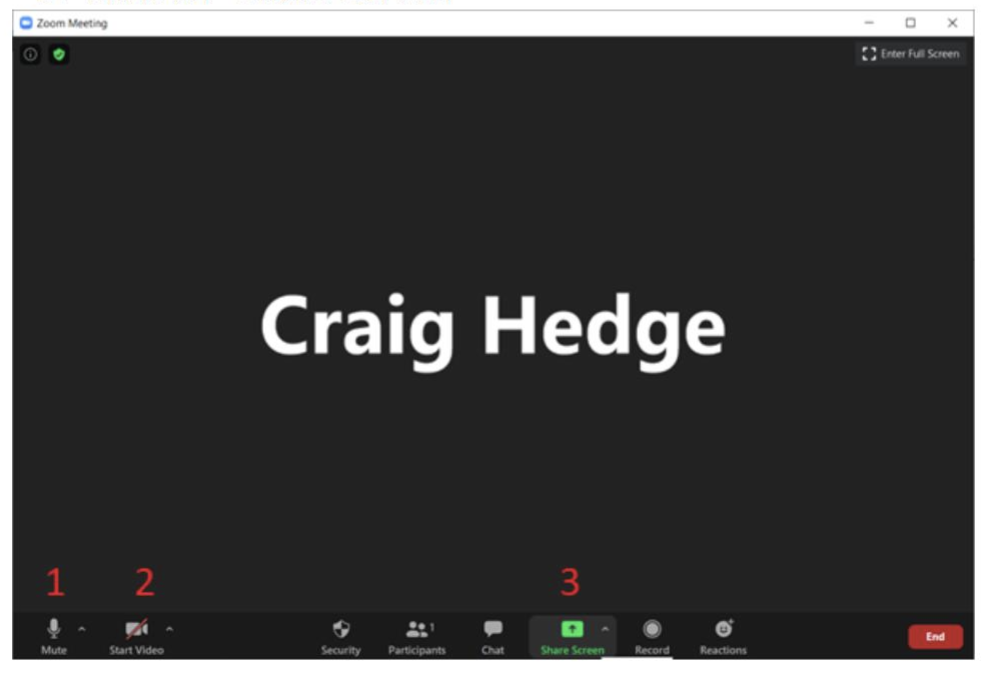

--- 
title: "Abstracts of the 10th European Working Memory Symposium"
author: "Cardiff University Steering Committee for EWoMSX: Candice Morey, Craig Hedge, & Lizzie Smith"
date: "`r Sys.Date()`"
site: bookdown::bookdown_site
output: bookdown::gitbook
documentclass: book
bibliography: [book.bib, packages.bib]
biblio-style: apalike
link-citations: yes
fontsize: 12pt
linestretch: 1.5
description: "Abstracts and program for the 10th European Working Memory Symposium (EWoMS). EWoMS X was due to be held at Cardiff University 1-3 September 2020, but due to the uncertainty created by the novel coronavirus pandemic, the program will take place virtually. This program book includes details on the format of the sessions, information about where to find the pre-recorded talks, and abstracts of the research presented."
---

# The 10th European Working Memory Symposium

The 10th European Working Memory Symposium (EWoMSX) is also the 1st EWoMS to be held virtually. Instead of gathering in Cardiff on 1-3 September 2020, we will be "gathering" from our own locales to discuss the latest advances in working memory research. EWoMS has traditionally been a cozy gathering, excellent for showcasing the work of early career researchers and promoting discussion. We will attempt to preserve this spirit under the circumstances so that our community misses out on as little as possible while we have to work in this manner. 

## Theme: Working Memory in Action

Working memory highlights a distinction between dormant knowledge and information that is immediately relevant, and on the point of being used in the service of some action. At EWoMSX we will focus on relationships between memory and actions: broadly construed, this includes investigations of proposed internal processes that may strengthen or transform memories, investigations of sensorimotor interactions, and distinctions between sensorimotor and representation-based theories of immediate memory. 

## How EWoMSX will work

* Pre-recorded talks available on EWoMS Youtube channel from mid-August

* Sessions will take place via Zoom. All registered participants will receive the Zoom link via email on 28 August. The first 30 minutes of the 90-minute sessions will include some time for unstructured chat with the authors of talks in the session, followed by discussant-led consideration of the theme of the session. 

* Watch the talks associated with a session ahead of the session start time (link will be available here from mid-August).

* Push questions to discussants - via email and social media in advance! Help shape what we discuss during these times. Discussants' contact information is available in each section's session.

## Registration

Registration is now closed. 

## Other interactions

* Proposal meetings: Some abstracts have been presented prior to the official start of EWoMSX to smaller groups of researchers, with the aim of providing advice on projects that were disrupted by the novel coronavirus pandemic. These abstracts are available along with authors' contact information in case you would like to discuss their projects with them. *Recordings of these presentations of preliminary work are not available on the YouTube channel*.

* Local hubs -  in some regions, it may be possible in September for small groups to gather together for the EWoMS sessions. If this applies in your region, you can organize a hub. If you are organizing a hub, let us know how it goes and tag #EWOMSX on social media with your ideas for making it festive and your pictures!

* We strongly encourage the community to organize online meet-up possibilities convenient to their time-zones, which we will help broadcast to the conference attendees.

## Schedule Overview

Although EWoMS is situated in Europe, we have delegates from all hemispheres. We have tried to ensure that the times of the sessions are possible for the speakers associated with the session to attend. 

```{r, echo=F}
knitr::include_graphics("ewomsSched.png")
```

## Recording and sharing your talk/poster

Presentations must be recorded and made available to the local committee for uploading by 7 August 2020. If your presentation was accepted as a **talk** please limit your recording to 20 minutes. If your presentation was accepted as a **poster** please limit your recording to 8 minutes; you may also use distinct slides rather than crowd your visuals onto one space if that makes recording easier, but please limit yourself to the amount of visuals that usually fit onto a poster, and the short walk-through that you would usually give to a visitor of your poster.

You may record your talk using any method that allows you to save it as an MPEG-4/MP4. This includes using the Office 365 version of Powerpoint's functionality to record your webcam video along with your presentation or older versions of Powerpoint that allow you to record your narration, along with your slide show. You may also use Zoom to record webcam footage along with any presentation software. What's important: the format of the file must be an MPEG-4/MP4, but you may choose whether this video includes just slides and voice-over narration, or slides plus webcam footage.

Upload your video file to a file hosting service (e.g. Dropbox, Google Drive, OneDrive, etc.) and email the link to ewomsx@cardiff.ac.uk by 7 August 2020. Because of typical mailbox limits, we probably cannot receive your video as an attachment. 

### General tips for recording effectively

* Whatever program you use, recording in editable modules helps save time. Powerpoint allows you to record or change the narration on individual slides, which can be useful if you want to go back and make changes. 
* We recommend a brief test with your setup first (i.e. recording a couple of slides with narration and saving as a video).

* Please check that your recording appears how you want it to before sending your link to us - we will not be editing!

* Please stick to your time limit, or even undershoot it if possible. If you can deliver your message clearly and concisely, we think you will find that more delegates will attend to it. 

### Tips for recording using PowerPoint

These instructions are for PowerPoint 365, but instructions are largely the same for other versions of PowerPoint.

In PowerPoint you can record the full presentation in one go, or you can record slides separately. If you record the full presentation you have the option to rerecord any slide/s.

Helpful instructions are also available on [YouTube.](https://www.youtube.com/watch?v=f8u_QDZLqMs)

#### Open presentation:

* Click slideshow on the main menu.

* Click record slide show.

* You have the option to record from the beginning or from the current slide. If you want to record slides separately select from current slide.

```{r, echo=F}
knitr::include_graphics("powerpoint1.png")
```

### On the recording screen:

* Your webcam will automatically turn on, you can select to turn it off if you prefer

* Check your audio is enabled (Note having headphones plugged in can sometimes prevent the audio from recording)

* Click RECORD

* When you have finished recording a slide/s, or the full presentation, click STOP

* Click the cross in top right to exit. All the slides you have recorded will automatically be saved.

```{r, echo=F}

```

#### Once you have recorded your narration for all slides:

* On the main menu click file, export, and select Create a Video,

* Select Create Video (Note ‘seconds spent on each slide’ only applies to unnarrated slides).

* Save to chosen file location (Note it can take quite some time to save).

```{r, echo=F}

```


### Tips for recording using Zoom

* In your web browser, go to https://zoom.us/. Create an account (it’s free) and download the software.

```{r, echo=F}
knitr::include_graphics("zoom1.png")
```

* In the Zoom client, sign in using the account you created.

```{r, echo=F}
knitr::include_graphics("zoom2.png")
```

* Start a new meeting (orange icon).

```{r, echo=F}
knitr::include_graphics("zoom3.png")
```

* Open your presentation in your software of choice (e.g. Powerpoint).

* On the main Zoom menu:

1. Check that your audio is enabled

2. Your webcam is enabled if you wish

3. Click on “Share Screen”

```{r, echo=F}

```

* Select your presentation from the available screens to share. Note that if you check “Optimize Screen Sharing for Video Clip”, your webcam image may not be displayed during your presentation.

```{r, echo=F}

```

* Start your slideshow in your presentation software as you normally would. Select “More” from the menu and “Record”. You can now do your presentation.

```{r, echo=F}

```

* When you have finished your presentation, go to the menu:

1. Stop recording

2. Stop sharing the screen

```{r, echo=F}
knitr::include_graphics("zoom7.png")
```

* End the meeting (bottom right corner). Select “End meeting for all”.

```{r, echo=F}

```

* Back on the main Zoom menu, you should see a message saying that your recording is being converted. This may take a while.

```{r, echo=F}

```

* When it has finished, several files should be saved in a folder on your computer. It is the MP4 file that you should send to us.

```{r, echo=F}

```
